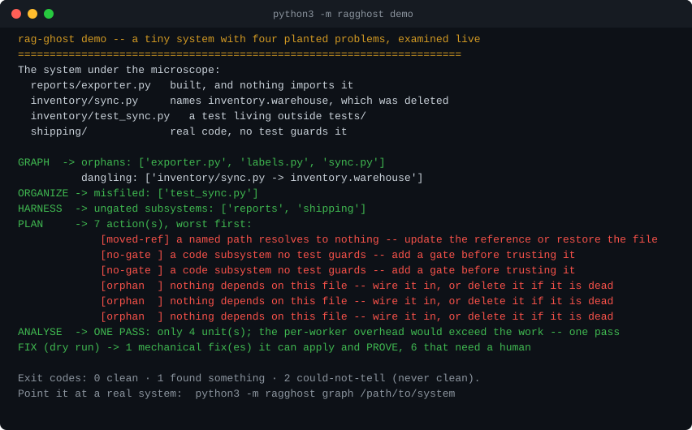

# rag-graph-surgeon

**Point it at a system and find out whether everything it promises, points at, or schedules actually exists and fires — then fix what can be fixed mechanically.**

[](https://github.com/Cshearer210/rag-graph-surgeon/actions/workflows/ci.yml)


<!-- # ragghost: allow GRAPH-DANGLING -- the CI badge above is a github.com URL ending in ci.yml, not a moved local path; suppressed in the open so `check .` on this repo stays honest. -->

> The import package is `ragghost` (`python3 -m ragghost ...`); the repository and distribution are named `rag-graph-surgeon`.

Most tools that audit a codebase answer *"is this file OK?"*. This one asks the opposite question —
*"does everything this system promises, points at, or schedules actually exist and fire?"* — because
that is where the failures that survive for months live.

---

## Why it exists

A system does not usually break loudly. It breaks like this:

- a check that has run green every night for five weeks **and has never once looked at anything**
- a scheduled job whose file was renamed, so the scheduler runs nothing and reports success
- a tool that was built, is correct, passes its own tests, and **nothing calls it**
- a document that says a thing is fixed, written before the thing broke again
- a count that shrank because the scan got narrower, not because the problem got smaller

Every one of those is invisible from the inside. A clean report and an unasked question look
identical. **rag-graph-surgeon is built to tell them apart.**

---

## How it works

Eight stages, run individually or all at once:

| # | stage | what it does |
|---|---|---|
| 1 | **SCAN** | discover every file and every population, with a denominator that comes from a second, independent count |
| 2 | **GRAPH** | a dependency graph both ways — what breaks if this changes, and what breaks if this moves |
| 3 | **ORGANIZE** | sort files into a tiered structure; index what must not move rather than moving it |
| 4 | **RETRIEVE** | build an offline retrieval layer so the system can answer questions about itself — and audit that layer, because a retriever that returns nothing looks like a system with nothing in it |
| 5 | **HARNESS** | separate the system into subsystems and flag any with no gate, check or test guarding it |
| 6 | **PLAN** | generate a harm-ranked plan of what to do, built from the real findings of stages 1–5 |
| 7 | **ANALYSE** | decide whether the work divides into independent units worth fanning out — and refuse the fan-out where it would not pay off |
| 8 | **FIX** | apply what can be applied mechanically, and prove each fix with a check that fires on its own |

Three rules it holds itself to:

**1. Three outcomes, three exit codes.** `0` clean · `1` found something · `2` could not tell.
A check that cannot look must never report clean. Most tools have two outcomes, which is why
"nothing found" and "nothing worked" are so often the same output.

**2. Every number carries its denominator, and the denominator comes from somewhere else.**
`0 findings` is unfalsifiable. `0 findings across 1,412 files, where the disk holds 1,412` is
checkable by anyone in two seconds — and when the two counts disagree, **the disagreement is the
finding.**

**3. A population is discovered, never typed.** A hand-written list of things to check is a list
of what somebody remembered, and the thing nobody remembered is where the bug is.

---

## Limits, up front

This is a wiring-and-topology auditor, not a full static analyser. It works at file and module
level and never executes the code it points at. These are the boundaries of its scope today —
named plainly rather than left to look covered:

- **Symbol-level dead code** — a function that is exported but never *called*. File-level orphans
  are caught; symbol-level ones are not.
- **Duplicate definitions** — the same symbol defined in two files, where fixing one leaves the
  other stale.
- **Test-shape rot** — a test that asserts nothing, swallows its own exception, or is permanently
  skipped.
- **Config rot** — a config key nothing reads, or an environment variable referenced but set
  nowhere.
- **Ghost pointers in prose** — a doc that names a script or path that does not exist.

None of these are silently mishandled; they are simply out of scope, and each is a candidate for a
future stage. Mutation-based checks (a test that passes because the code cannot make it fail) are
also out of scope.

See the honest per-stage *Status* table near the bottom for what is built and working today.

---

## Install and run

**No dependencies. No account. No API key. No network.** The tool imports only the Python standard
library, and it never reaches out over the network for anything.

```bash
git clone https://github.com/Cshearer210/rag-graph-surgeon
cd rag-graph-surgeon

python3 -m ragghost demo                          # the 15-second tour (self-contained)
python3 -m ragghost scan /path/to/any/system      # then point it at a real system
```

Every read-only stage leaves the target untouched. The one exception is stage 8 (`fix`), which is a
dry run by default and writes only mechanical, reversible fixes when you add `--apply` — re-measuring
the world after each edit and rolling it back if the defect is not actually gone.

Requires Python 3.11 or newer. `pytest` is needed only to run the test suite, not to run the tool.

## Minimal example

```python
import ragghost

# Stage 1 (SCAN), read-only: discover every file, count two independent ways, report drift.
result = ragghost.scan("path/to/any/system")
result.report()
raise SystemExit(result.exit_code())   # 0 clean · 1 found something · 2 could-not-tell
```

Every stage has the same shape: a function that returns a result with `.report()` and
`.exit_code()`. `ragghost.check(path)` runs all of them and rolls the findings into one report.

## See it in 15 seconds



```
$ python3 -m ragghost demo
rag-ghost demo -- a tiny system with four planted problems, examined live
======================================================================
The system under the microscope:
  reports/exporter.py   built, and nothing imports it
  inventory/sync.py     names inventory.warehouse, which was deleted
  inventory/test_sync.py   a test living outside tests/
  shipping/             real code, no test guards it

GRAPH  -> orphans: ['exporter.py', 'labels.py', 'sync.py']
          dangling: ['inventory/sync.py -> inventory.warehouse']
ORGANIZE -> misfiled: ['test_sync.py']
HARNESS  -> ungated subsystems: ['reports', 'shipping']
PLAN     -> 7 action(s), worst first:
             [moved-ref] a named path resolves to nothing -- update the reference or restore the file
             [no-gate ] a code subsystem no test guards -- add a gate before trusting it
             [no-gate ] a code subsystem no test guards -- add a gate before trusting it
             [orphan  ] nothing depends on this file -- wire it in, or delete it if it is dead
             [orphan  ] nothing depends on this file -- wire it in, or delete it if it is dead
             [orphan  ] nothing depends on this file -- wire it in, or delete it if it is dead
ANALYSE  -> ONE PASS: only 4 unit(s); the per-worker overhead would exceed the work -- one pass
FIX (dry run) -> 1 mechanical fix(es) it can apply and PROVE, 6 that need a human

Exit codes: 0 clean · 1 found something · 2 could-not-tell (never clean).
Point it at a real system:  python3 -m ragghost graph /path/to/system
```

`python3 -m ragghost demo` builds a tiny broken system in a temp directory and runs every stage
against it, live — so the demo can never drift from the tool. The output above is captured verbatim
from a real run.

---

## Drops into CI

```bash
python3 -m ragghost check .                 # every finding, ranked, human-readable
python3 -m ragghost check . --format json   # for a script
python3 -m ragghost check . --format sarif  # for GitHub code scanning / a dashboard
```

Exit `0` clean · `1` found something · `2` could-not-tell (never treat as clean).

- **Choose which checks run** — a `.ragghost.json` in the target root:
  `{"select": ["GRAPH-DANGLING"], "ignore": ["ORG-MISFILED"]}` (by code, or by family like `GRAPH`).
- **Silence one on a single file** — a line in that file: `# ragghost: allow GRAPH-ORPHAN`
  (or `# ragghost: allow ALL`). Explicit, local, and visible in review.
- **Add your own check** — register a callable under the `ragghost.checks` entry point, or ship a
  `ragghost_plugin_*` module exposing `CHECKS = [fn]`. A plugin that raises is reported and skipped,
  never silently dropping the run to a clean result.

Codes: `SCAN-DRIFT` · `GRAPH-ORPHAN` · `GRAPH-DANGLING` · `ORG-MISFILED` · `HARNESS-NOGATE` · `RETR-BLIND`.

This repository holds itself to its own standard: `python3 -m ragghost check .` exits `0`. A
`.ragghost.json` and two inline `# ragghost: allow` comments scope out three known false positives,
each with a stated reason, in the open — the standalone `tools/` script that regenerates the demo
SVG (deliberately not imported), and the CI badge URL that resembles a moved local `ci.yml`. Same
suppression features documented above; nothing silenced without a reason a reviewer can read.

## Status, honestly

| stage | state |
|---|---|
| 1 SCAN | **working** — discovers files, classifies them, counts two independent ways, reports drift |
| 2 GRAPH | **working** — dependency graph both directions; dangling refs and orphans |
| 3 ORGANIZE | **working** — tiered index; what is load-bearing vs movable; misfiled files |
| 4 RETRIEVE | **working** — offline tf-idf index; audits itself with a present probe and a noise probe |
| 5 HARNESS | **working** — splits into subsystems; flags any with no gate |
| 6 PLAN | **working** — a harm-ranked plan built from the real findings of stages 1–5 |
| 7 ANALYSE | **working** — decides if the work divides; refuses a fan-out that would not pay off |
| 8 FIX | **working** — dry-run by default; applies only the mechanical class and proves each edit |

Roadmap is the *Limits, up front* list above — the detectors not yet built. This table is the only
place status is claimed, and it is updated in the same commit as the work. A README that describes a
version that was never shipped is the first defect this tool looks for in somebody else's repo, so it
would be a poor place to start.

## Verify it yourself

```bash
python3 -m pytest -q tests     # 292 tests, standard library only + pytest as the runner
python3 -m ragghost demo       # runs all eight stages against a live, self-built broken system
```

The suite covers **98% of the package** by line (`coverage run -m pytest && coverage report`), and
half of it asserts the tool *refuses* to say clean — because a test suite that can only ever produce
a passing result would share the exact blind spot this tool exists to remove. Property-based tests
(via `hypothesis`, a dev-only extra) check the fan-out decision and the scanner's two-count
agreement across generated inputs. Install the dev extras with `pip install -e ".[test]"`.

## License

MIT — see [LICENSE](LICENSE). Copyright (c) 2026 Chris Shearer.
